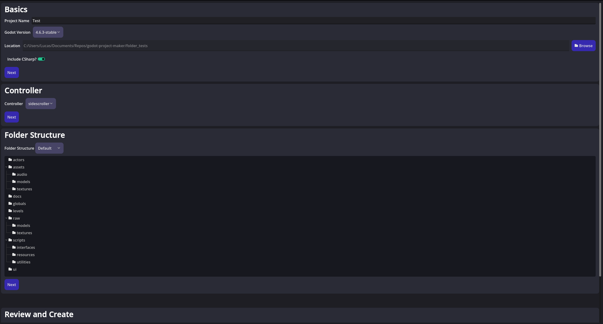

 

A tool to scaffold, organize, and manage Godot Engine projects with ease.

## Overview

Godot Project Maker is a utility meant as a quick way to scaffold a new Godot project. It started as a way to help me with my one-project-a-month habit. 

## Prerequisites
- [GDVM](https://github.com/adalinesimonian/gdvm) for version management

## Contributing

Contributions are welcome! Please open issues or pull requests for suggestions, bug fixes, or new features.

Made with ❤️ for the Godot community.
